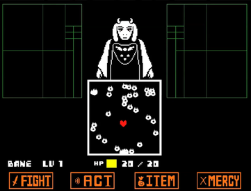

---
up:
  - "[[collection-game-item|collection-game-item]]"
title: Undertale
title-slugified: undertale
title-wikipedia: Undertale - Wikipedia
url-wikipedia: https://en.wikipedia.org/wiki/Undertale
icon: "[[Undertale_vector_logo_on_black_borders.png]]"
icon-url: https://commons.wikimedia.org/wiki/File:Undertale_vector_logo_on_black_borders.svg>
cover:
cover-url:
image: "[[Undertale_Combat_Example.png]]"
image-url: https://en.wikipedia.org/wiki/File:Undertale_Combat_Example.png
description: Undertale is a 2015 role-playing video game created by American indie developer Toby Fox.
description-wikipedia: "Undertale is a 2015 role-playing video game created by American indie developer Toby Fox. The player controls a child who has fallen into the Underground: a large, secluded region under the surface of the Earth, separated by a magical barrier. The player meets various monsters during the journey back to the surface, some of which may engage in combat. The combat system involves the player navigating through mini–bullet hell attacks by the opponent. They can opt to appease monsters in order to spare them instead of killing them. These choices affect the game, with the dialogue, characters, and story changing based on outcomes."
categories:
  - "[[game-category-rpg|rpg]]"
mtime: 2026-01-08T15:39:30+08:00
ctime: 2026-01-08T15:39:30+08:00
---

# Undertale

> see [Undertale - Wikipedia](https://en.wikipedia.org/wiki/Undertale)

Undertale is a 2015 role-playing video game created by American indie developer Toby Fox. The player controls a child who has fallen into the Underground: a large, secluded region under the surface of the Earth, separated by a magical barrier. The player meets various monsters during the journey back to the surface, some of which may engage in combat. The combat system involves the player navigating through mini–bullet hell attacks by the opponent. They can opt to appease monsters in order to spare them instead of killing them. These choices affect the game, with the dialogue, characters, and story changing based on outcomes.

| | |
| --- | --- |
| up | [[collection-game-item\|collection-game-item]] |
| icon |  <https://commons.wikimedia.org/wiki/File:Undertale_vector_logo_on_black_borders.svg> |
| image |  <https://en.wikipedia.org/wiki/File:Undertale_Combat_Example.png> |
