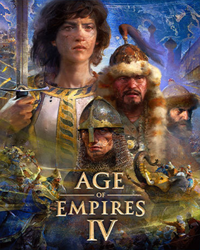

---
up:
  - "[[collection-game-item|collection-game-item]]"
title: Age of Empires IV
title-slugified: age-of-empires-4
title-wikipedia: Age of Empires IV - Wikipedia
url-wikipedia: https://en.wikipedia.org/wiki/Age_of_Empires_IV
icon:
icon-url:
cover: "[[Age_of_Empires_IV_Cover_Art.png]]"
cover-url: https://en.wikipedia.org/wiki/File:Age_of_Empires_IV_Cover_Art.png
image:
image-url:
description: Age of Empires IV is a real-time strategy video game developed by Relic Entertainment in partnership with World's Edge and published by Xbox Game Studios.
description-wikipedia: Age of Empires IV is a real-time strategy video game developed by Relic Entertainment in partnership with World's Edge and published by Xbox Game Studios. It is the fourth installment of the Age of Empires series, and the first installment not developed by Ensemble Studios. The game was released on October 28, 2021 for Windows, August 22, 2023 for Xbox One and Xbox Series X/S, and on November 4, 2025 for PlayStation 5.
categories:
  - "[[game-category-rts|rts]]"
order: 3
ctime: 2026-01-08T15:39:38+08:00
mtime: 2026-01-08T15:39:38+08:00
---

> see [Age of Empires IV - Wikipedia](https://en.wikipedia.org/wiki/Age_of_Empires_IV)

Age of Empires IV is a real-time strategy video game developed by Relic Entertainment in partnership with World's Edge and published by Xbox Game Studios. It is the fourth installment of the Age of Empires series, and the first installment not developed by Ensemble Studios. The game was released on October 28, 2021 for Windows, August 22, 2023 for Xbox One and Xbox Series X/S, and on November 4, 2025 for PlayStation 5.

| | |
| --- | --- |
| Up | [[collection-game-item\|collection-game-item]] |
| Type |  |
| Cover |  <https://en.wikipedia.org/wiki/File:Age_of_Empires_IV_Cover_Art.png> |
