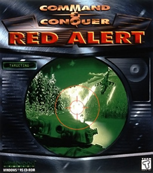

---
up:
  - "[[collection-game-item|collection-game-item]]"
title: "Command & Conquer: Red Alert"
title-slugified: command-and-conquer-red-alert
title-wikipedia: "Command & Conquer: Red Alert - Wikipedia"
url-wikipedia: https://en.wikipedia.org/wiki/Command_%26_Conquer:_Red_Alert
icon:
icon-url:
cover: "[[Cncra-win-cover.jpg]]"
cover-url: https://en.wikipedia.org/wiki/File:Cncra-win-cover.jpg
image:
image-url:
description: "Command & Conquer: Red Alert is a real-time strategy video game in the Command & Conquer franchise, developed and published by Westwood Studios in 1996."
description-wikipedia: "Command & Conquer: Red Alert is a real-time strategy video game in the Command & Conquer franchise, developed and published by Westwood Studios in 1996. The second game to bear the Command & Conquer title, Red Alert is the prequel to the original Command & Conquer of 1995, and takes place in the alternate early history of Command & Conquer when Allied Forces battle an aggressive Soviet Union for control over the European mainland."
categories:
  - "[[game-category-rts|rts]]"
order: 2
ctime: 2026-01-08T15:39:35+08:00
mtime: 2026-01-08T15:39:35+08:00
---

# Command & Conquer: Red Alert

> see [Command & Conquer: Red Alert - Wikipedia](https://en.wikipedia.org/wiki/Command_%26_Conquer:_Red_Alert)

Command & Conquer: Red Alert is a real-time strategy video game in the Command & Conquer franchise, developed and published by Westwood Studios in 1996. The second game to bear the Command & Conquer title, Red Alert is the prequel to the original Command & Conquer of 1995, and takes place in the alternate early history of Command & Conquer when Allied Forces battle an aggressive Soviet Union for control over the European mainland.

| | |
| --- | --- |
| Cover |  <https://en.wikipedia.org/wiki/File:Cncra-win-cover.jpg> |
