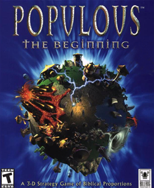
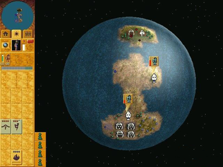

---
up:
  - "[[collection-game-item|collection-game-item]]"
title: "Populous: The Beginning"
title-slugified: populous-the-beginning
title-wikipedia: "Populous: The Beginning - Wikipedia"
url-wikipedia: https://en.wikipedia.org/wiki/Populous:_The_Beginning
icon:
icon-url:
cover: "[[Populous-the-beginning.png]]"
cover-url: https://en.wikipedia.org/wiki/File:Populous-the-beginning.png
image: "[[Populous_overworld.png]]"
image-url: https://en.wikipedia.org/wiki/File:Populous_overworld.png
description: "Populous: The Beginning is a real-time strategy video game and the third entry in the Populous series, developed by Bullfrog Productions."
description-wikipedia: "Populous: The Beginning is a real-time strategy video game and the third entry in the Populous series, developed by Bullfrog Productions. The game was released in 1998 on Microsoft Windows, and in 1999 for the PlayStation. Unlike earlier games in the series, which cast the player in the role of a god influencing loyal followers, The Beginning took a radical departure and placed the player in the role of a shaman, who directly leads her tribe against opponents. Throughout the twenty-five missions of the campaign, the player leads their tribe across a solar system, dominating enemy tribes and tapping new sources of magic, with the ultimate goal of the shaman attaining godhood herself."
categories:
  - "[[game-category-rts|rts]]"
order: 4
ctime: 2026-01-08T15:55:07+08:00
mtime: 2026-01-08T15:55:07+08:00
---

### Populous: The Beginning

> see [Populous: The Beginning - Wikipedia](https://en.wikipedia.org/wiki/Populous:_The_Beginning)

Populous: The Beginning is a real-time strategy video game and the third entry in the Populous series, developed by Bullfrog Productions. The game was released in 1998 on Microsoft Windows, and in 1999 for the PlayStation. Unlike earlier games in the series, which cast the player in the role of a god influencing loyal followers, The Beginning took a radical departure and placed the player in the role of a shaman, who directly leads her tribe against opponents. Throughout the twenty-five missions of the campaign, the player leads their tribe across a solar system, dominating enemy tribes and tapping new sources of magic, with the ultimate goal of the shaman attaining godhood herself.

| | |
| --- | --- |
| Cover |  <https://en.wikipedia.org/wiki/File:Populous-the-beginning.png> |
| Image |  <https://en.wikipedia.org/wiki/File:Populous_overworld.png> |
