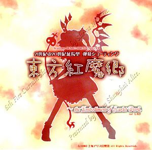

---
up:
  - "[[collection-game-item|collection-game-item]]"
title: Embodiment of Scarlet Devil
title-slugified: game-item-embodiment-of-scarlet-devil
title-wikipedia: Embodiment of Scarlet Devil - Wikipedia
url-wikipedia: https://en.wikipedia.org/wiki/Embodiment_of_Scarlet_Devil
icon:
icon-url:
cover: "[[Th06cover.jpg]]"
cover-url: https://en.wikipedia.org/wiki/File:Th06cover.jpg
image:
image-url:
description: 'Touhou Koumakyou ~ The Embodiment of Scarlet Devil (Japanese: 東方紅魔郷 〜 the Embodiment of Scarlet Devil.; lit. "Eastern Lands of the Scarlet Devil") is a bullet hell vertically scrolling shooter developed by Team Shanghai Alice.'
description-wikipedia: 'Touhou Koumakyou ~ The Embodiment of Scarlet Devil (Japanese: 東方紅魔郷 〜 the Embodiment of Scarlet Devil.; lit. "Eastern Lands of the Scarlet Devil") is a bullet hell vertically scrolling shooter developed by Team Shanghai Alice. It is the sixth entry in the Touhou Project series, and the first to be released for Microsoft Windows. It follows either the miko Reimu Hakurei or the magician Marisa Kirisame as they battle enemies through the world of Gensokyo to find the cause of a red-colored mist which has covered the sky in the midst of summer.'
categories:
  - "[[game-category-stg|stg]]"
ctime: 2026-01-08T15:39:26+08:00
mtime: 2026-01-08T15:39:26+08:00
---

# Embodiment of Scarlet Devil

> see [Embodiment of Scarlet Devil - Wikipedia](https://en.wikipedia.org/wiki/Embodiment_of_Scarlet_Devil)

Touhou Koumakyou ~ The Embodiment of Scarlet Devil (Japanese: 東方紅魔郷 〜 the Embodiment of Scarlet Devil.; lit. "Eastern Lands of the Scarlet Devil") is a bullet hell vertically scrolling shooter developed by Team Shanghai Alice. It is the sixth entry in the Touhou Project series, and the first to be released for Microsoft Windows. It follows either the miko Reimu Hakurei or the magician Marisa Kirisame as they battle enemies through the world of Gensokyo to find the cause of a red-colored mist which has covered the sky in the midst of summer.

| | |
| --- | --- |
| up | [[collection-game-item\|collection-game-item]] |
| cover |  <https://en.wikipedia.org/wiki/File:Th06cover.jpg> |
